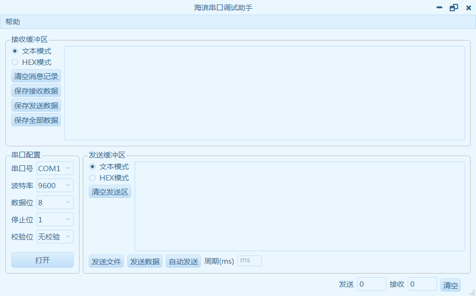

# 海滨串口助手

## 特征

- 基于QT，具有跨平台优势
- 重绘界面，不使用本地化界面，在任何系统下看到的界面都是一样的
- 功能使用且强大
- 开放源代码，允许用户自由更改

## 界面截图

## 功能简介

1. 发送和接收时带时间
2. 自动搜索可用串口
3. 支持16进制发送和16进制查看，且保留历史发送和接收数据
4. 16进制和普通文本任意查看
5. 支持保存接收和发送数据

## 备注
1. mac和linux下面的可执行程序请自行打包
